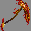

# 4. NPC (Spoiler)

You can find NPCs at the spawn which gives you access to many features!\
Below are the NPCs and their locations that are available at this moment.\
\
Blacksmith (116, 2, 139)

.png>)\
The Blacksmith allows you to forge and upgrade your equipment!\
Custom materials are obtained through crafting or killing mobs and looting structures in the adventure world.\
\
\
\
Gardener (132, 2, 124)\
.png>)\
The Gardener sells the equipment you need to start a custom crops farm.

\
\
Farmer (91, 12, 259)\
.png>)\
You can sell custom crops to the farmer to make a lot of profit!

Engineer (211, 3, 116)\
.png>)\
Sells infuse hopper and shulker box.\
Or buy a new slimefun guide if you lost yours!

\
\
Lumberjack (113, -1, 61)\
.png>)\
Unlock access to Jobs.

Furniture Seller (223, 9, 207)\
\
Sells custom furniture!
